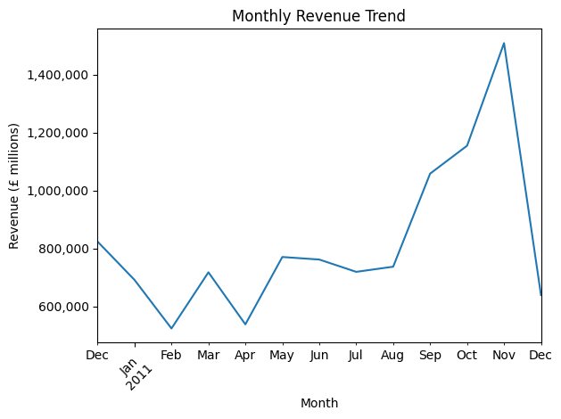
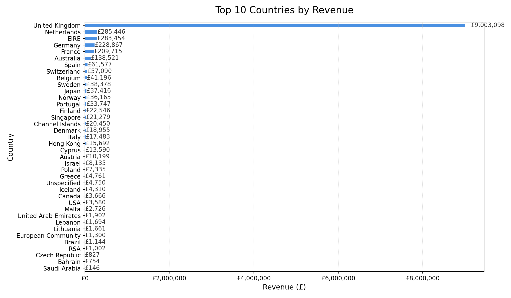
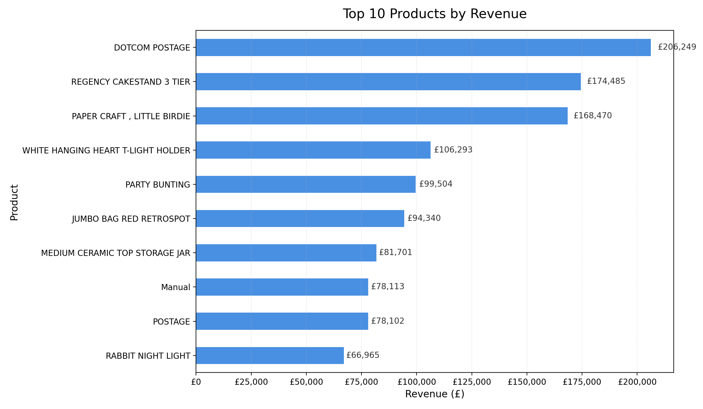

# 📊 Retail Sales KPI Analysis  
`https://img.shields.io/badge/Python-3.10%2B-blue.svg`  
`https://img.shields.io/badge/MySQL-8.0-orange.svg`  
`https://img.shields.io/badge/Matplotlib-3.7+-orange.svg`  
`https://img.shields.io/badge/Project-Active-brightgreen.svg`  
[`https://knhf.github.io`](https://knhf.github.io)

A practical, end‑to‑end data engineering and analytics workflow that transforms raw retail transactions into validated, structured, and business‑ready insights. The project demonstrates ingestion, cleaning, MySQL storage, automated data quality checks, KPI generation, and visual reporting.

---

## 🚀 Overview

This project simulates a lightweight BI/data‑engineering pipeline:

1. **Ingest** raw CSV data  
2. **Clean & validate** the dataset  
3. **Store** it in a relational database  
4. **Run** automated data quality checks  
5. **Generate** revenue KPIs and text‑based reports  
6. **Visualise** key business metrics  

The dataset used is the *Online Retail* dataset from Kaggle:  
🔗 `https://www.kaggle.com/datasets/ulrikthygepedersen/online-retail-dataset` [(kaggle.com in Bing)](https://www.bing.com/search?q="https%3A%2F%2Fwww.kaggle.com%2Fdatasets%2Fulrikthygepedersen%2Fonline-retail-dataset")

---

## 💡 Why This Project Matters

Retail datasets are messy, inconsistent, and high‑volume. This project demonstrates how to turn raw transactional data into reliable KPIs that support revenue analysis, operational decisions, and BI reporting. It showcases practical skills in:

- Data cleaning  
- Data validation  
- SQL storage  
- KPI engineering  
- Visual analytics  
- Modular Python workflow design  

---

## 🛠️ Tech Stack

- **Python** (pandas, matplotlib)  
- **MySQL 8.0**  
- **VS Code**  
- **Git / GitHub**

---

## ⚙️ Setup

Clone the repository and run the pipeline locally.

### 1. Create a virtual environment
```
python -m venv venv
```

### 2. Activate it
Windows:
```
venv\Scripts\activate
```

### 3. Install dependencies
```
pip install -r requirements.txt
```

### 4. Configure MySQL credentials  
Update connection details inside `load_data.py`.

### 5. Run the pipeline
```
python src/load_data.py
python src/data_quality.py
python src/generate_report.py
```

Outputs will appear in `/reports` and `/outputs`.

---

## 🧱 Architecture

```
CSV → Cleaning → MySQL Storage → Quality Checks → KPI Analysis → Reports & Visuals
```

All processing steps are modularised inside `src/` for clarity and reusability.

---

## ✨ Key Features

### 📥 Data Ingestion
- Efficient CSV loading  
- Safe datetime parsing  
- Handling of missing/invalid values  
- Inserts cleaned data into MySQL  

### 🔍 Data Quality Validation
- Missing value detection  
- Duplicate row checks  
- Negative quantity checks  
- Zero/negative price checks  
- Country distribution checks  

### 📈 KPI Reporting
- Total revenue  
- Top 10 products  
- Revenue by country  
- Monthly revenue trend  
- Removal of cancellations and invalid transactions  

### 🖼️ Visual Outputs  
Saved to the `outputs/` directory:

- Monthly revenue trend  
- Top 10 products  
- Top 10 countries  

Charts are styled for clarity and business readability.

---

## 📸 Screenshots

### Monthly Revenue Trend  


### Top 10 Products  


### Top 10 Countries  


---

## 📊 Example Insights

- Total Revenue: **£10.6M**  
- Transactions across **38 countries**  
- Strong seasonal uplift in Q4  
- UK dominates overall revenue  

---

## 📁 Project Structure

```
project/
│
├── src/
│   ├── load_data.py
│   ├── data_quality.py
│   └── generate_report.py
│
├── data/
│   └── dataset.csv
│
├── reports/
│   ├── quality_report.txt
│   └── sales_kpi_report.txt
│
├── outputs/
│   ├── monthly_revenue_trend.png
│   ├── top_10_products.png
│   └── top_10_countries.png
│
└── notebooks/
    └── sales_analysis.ipynb
```

---

## ⚠️ Limitations

- Dataset is historical (2010–2011)  
- No customer‑level segmentation  
- No product hierarchy  
- No currency conversion  
- No timezone normalisation  
- MySQL schema is intentionally simple for demonstration  

---

## 🔮 Future Improvements

- Add SQL‑based aggregation for performance comparison  
- Introduce logging instead of print statements  
- Add primary keys and duplicate constraints  
- Implement automated unit tests  
- Optional: build a Streamlit dashboard  

---

## 👤 Author

**Karan Homayounfar**  
MSc Data Science — UWE Bristol  
Focused on Data Engineering & Quantitative Systems

---

## 📄 License

Released under the **MIT License**.  
Free to use, modify, and build upon.
